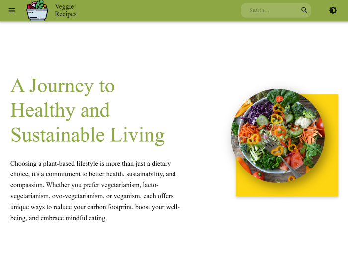
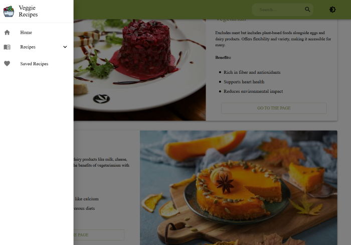
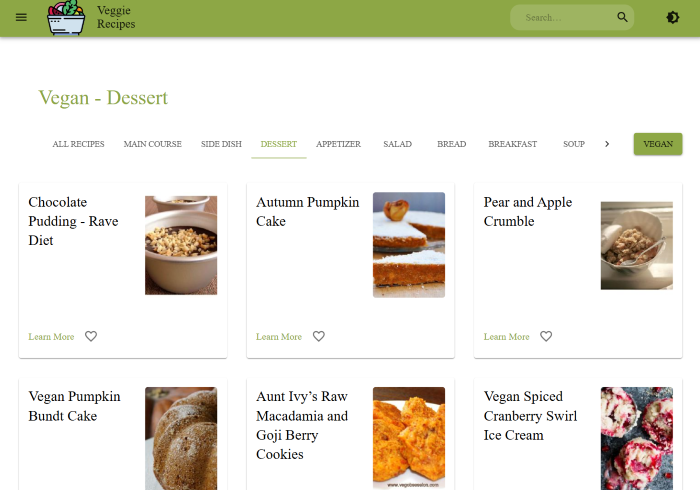
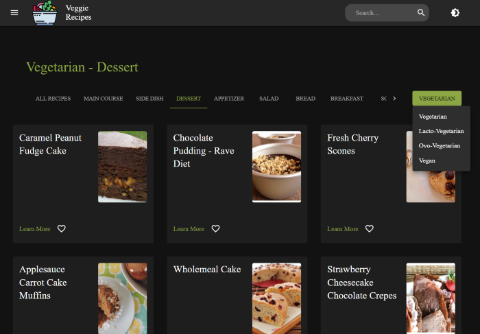
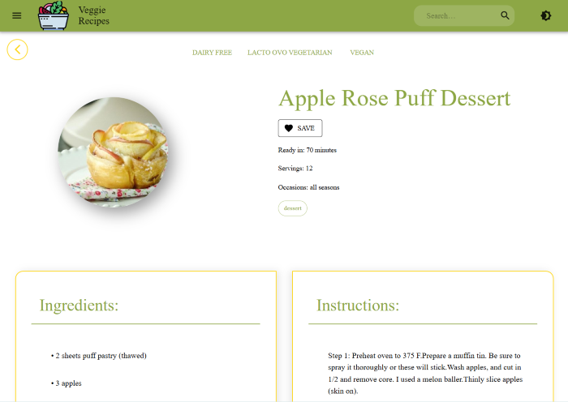
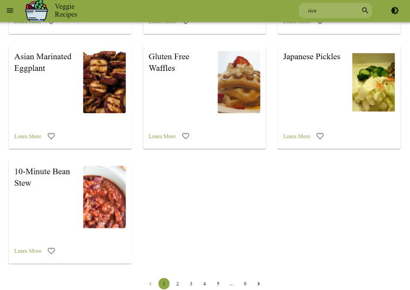
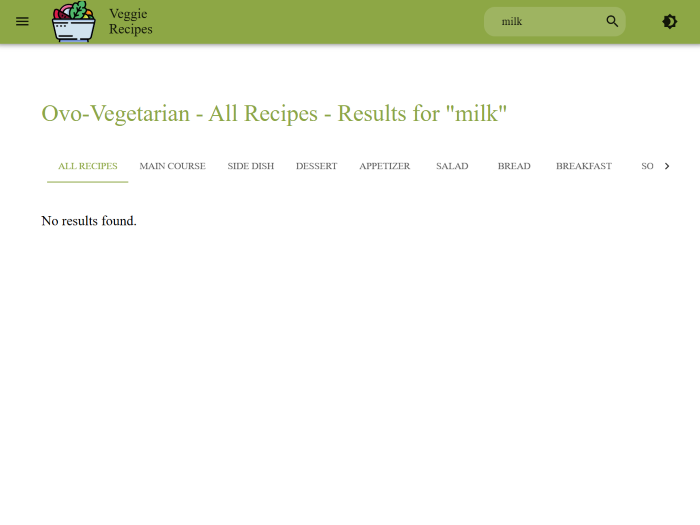
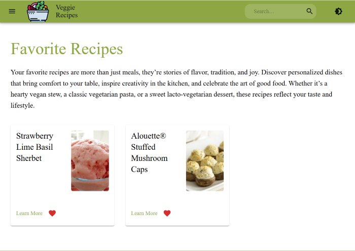

# Veggie Recipes

## Introduzione
Questo applicativo React è concepito per tutti coloro che seguono una dieta vegetariana. La piattaforma permette agli utenti di cercare e visualizzare ricette esclusive per vegetariani, ovo-vegetarian, lacto-vegetarian e vegane, sfruttando l'API di Spoonacular. L'utente può non solo sfogliare le ricette tramite comode card, ma anche filtrare i risultati per categoria (ad esempio dessert, main course), caricare ulteriori contenuti con il tasto "Load More", salvare le ricette preferite e ricercare tramite una barra apposita nell'AppBar.  
  
L'applicativo è interamente sviluppato con React, utilizzando Material UI per la realizzazione di componenti responsive e personalizzabili, e Redux per la gestione dello stato globale.  

## Link
[Link al progetto](https://veggierecipes-5cff3.web.app)

## Demo
Di seguito alcuni screenshot dimostrativi dell'applicazione:

- **Home:**  
 
  

- **Panoramica ricette:**



- **Dettagli Ricetta:**


- **Ricette per ricerca Specifica:**  


  
- **Ricette Preferite:**  



## Requisiti
Per eseguire correttamente il progetto sono necessarie le seguenti dipendenze:
  
| Pacchetto                   | Versione      |
|-----------------------------|---------------|
| @emotion/react              | ^11.14.0     |
| @emotion/styled             | ^11.14.0     |
| @mui/icons-material         | ^6.4.6       |
| @mui/material               | ^6.4.6       |
| @reduxjs/toolkit            | ^2.6.0       |
| axios                       | ^1.8.1       |
| react                       | ^19.0.0      |
| react-dom                   | ^19.0.0      |
| react-redux                 | ^9.2.0       |
| react-router                | ^7.2.0       |
| react-scripts               | ^5.0.1       |

Assicurati di avere installato Node.js e npm o yarn per gestire le dipendenze.

## Installazione
1. **Clona il repository:**

   ```bash
   git clone https://github.com/Dora2607/VeggieRecipes-React.git
   cd veggie-recipes-web-app
   ```
2. **Installa le dipendenze:**
npm install
3. **Avvia l'applicazione:**
npm run dev
4. **Accedi al sito web:**
Apri il tuo browser e vai a [http://localhost:5173](http://localhost:5173).


## Struttura del progetto 
Il progetto è organizzato in modo da essere facile da capire e da gestire. E
qui una breve descrizione di ogni cartella e file:
- **`public`**: contiene i file statici come l'immagine del logo e l
indice del sito web.
- **`src`**: contiene il codice sorgente dell'applicazione.
/src
│
├── assets                # Risorse statiche (immagini, etc.)
│
├── components            # Componenti riutilizzabili divise per area funzionale
│   
│
├── data                  # Dati statici (es. categorie)
│
├── layout               
│
├── pages                 # Componenti di pagina
│       ├── Home.jsx
│       ├── Recipes.jsx
│       ├── Recipe.jsx
│       ├── FavoriteRecipes.jsx
│       └── NotFound.jsx
│
├── service               # Strati di comunicazione con API (ex. apiService.js)
│
├── stores                # Configurazione di Redux (slice, store, etc.)
│
├── App.jsx               # Configurazione delle route e del provider Redux
│
└── main.jsx              # Punto d'entrata dell'applicazione (rendering)

## Utilizzo di Material UI
Il design dell'applicativo è realizzato con Material UI, che consente creare interfacce pulite, responsive e moderne.
In particolare attraverso l'uso della componente 'ThemeWrapper' è stato possibile personalizzare il tema (light e dark).
Il componente estrae lo stato corrente del tema (light o dark) dalla store di Redux e, basandosi su questo valore, crea un tema personalizzato. Questo tema, definito tramite le opzioni specificate per Material UI, viene poi fornito a tutti i componenti figli tramite il ThemeProvider.

## Routing

Il sistema di routing utilizza **React Router** per navigare tra le sezioni dell'applicazione. Include rotte principali come Home, Recipes e Preferiti, con sottorotte nidificate per dettagli specifici delle ricette. I parametri dinamici permettono di personalizzare le pagine (es. dieta selezionata o ID ricetta). È integrato con Redux per mantenere uno stato globale coerente e include una pagina di errore per gestire rotte non valide.


## Utilizzo di Redux

L'applicazione utilizza **Redux** per gestire lo stato globale in modo efficiente e centralizzato. È configurata con **Redux Toolkit** per semplificare la creazione delle slice e l'integrazione con React. Ecco una panoramica del suo utilizzo:

- **Store:**  
  Lo store raccoglie tutti i reducer definiti nelle varie slice, come quelle relative al tema, alle ricette e ai preferiti, garantendo una gestione strutturata e centralizzata dello stato.

- **Gestione del Tema:**  
  Una slice (`themeSlice`) è dedicata alla gestione della modalità (light/dark), con un'azione per alternare il tema, rendendolo dinamico e reattivo.

- **Ricette:**  
  Una slice (`recipesSlice`) è responsabile della gestione delle ricette, con funzionalità come il filtraggio per dieta o tipo e il caricamento dinamico tramite thunk per richieste asincrone alle API di Spoonacular.

- **Ricetta Specifica:**  
  Una slice (`recipeSlice`) si occupa del dettaglio di una singola ricetta, gestendo il caricamento e i relativi stati (loading, succeeded, failed).

- **Preferiti:**  
  La slice (`favoriteRecipesSlice`) gestisce l'aggiunta e la rimozione di ricette preferite, mantenendo un elenco di ricette selezionate dall'utente.

- **Ricerca:**  
  Una slice (`searchSlice`) permette la gestione delle query di ricerca per filtrare le ricette in base agli ingredienti.

### **Vantaggi dell'Approccio Redux**
1. Stato centralizzato per una gestione coerente.
2. Interazione facilitata tra componenti grazie alle slice modulari.
3. Supporto per operazioni asincrone con `createAsyncThunk`.
4. Codebase facilmente manutenibile.

## Chiamate API

Le chiamate API nell'applicazione consentono l'interazione con il servizio **Spoonacular API**, permettendo di ottenere ricette vegetariane e i dettagli delle singole ricette. La gestione delle richieste è implementata utilizzando **Axios**, offrendo un'interfaccia semplice per inviare richieste HTTP.

- **Fetch Recipes:**  
  Questa funzione richiede ricette in base a parametri come il tipo di dieta (vegetariana, lacto-vegetariana, ovo-vegetariana, vegana), categoria (`type`), e query di ricerca (`query`). Inoltre, gestisce la paginazione tramite offset e limita il numero di risultati per richiesta.

- **Fetch Recipe:**  
  Questa funzione recupera i dettagli di una singola ricetta specificando il relativo ID.

### **Gestione degli Errori**
- Vengono catturati errori comuni come API key non valida o dieta non supportata.
- Specifici messaggi di errore vengono restituiti in caso di risposta HTTP non valida (es. codice di errore 404 o 402).

## Panoramica delle Pagine

L'applicazione è composta da diverse pagine, ognuna progettata per offrire un'esperienza utente chiara e intuitiva:

- **RootLayout:**  
  Funziona come un layout principale che include la barra di ricerca globale (`SearchAppBar`) e un componente `Outlet` per gestire la visualizzazione delle pagine figlie.

- **Home:**  
  La homepage è una vetrina iniziale che accoglie gli utenti con un banner (`HeroBanner`) e una sezione introduttiva (`HomeSection`). Fornisce una panoramica delle funzionalità offerte dal sito.

- **Recipe:**  
  Mostra i dettagli di una ricetta specifica. Utilizza Redux per caricare i dati della ricetta selezionata tramite thunk asincroni. Include componenti come `TopRecipe`, `IngredientsRecipe` e `InstructionsRecipe` per organizzare le informazioni.

- **FavoriteRecipes:**  
  Presenta un elenco delle ricette salvate come preferite. Se l'elenco è vuoto, mostra un messaggio, altrimenti visualizza le ricette preferite come card.

- **NotFound:**  
  Una pagina di errore 404 che viene mostrata quando l'utente tenta di accedere a una rotta non valida. Include un pulsante per tornare alla homepage.

- **Recipes:**  
  Agisce come contenitore per le sottopagine delle ricette, utilizzando `Outlet` per mostrare contenuti dinamici basati sulla rotta (es. liste di ricette filtrate).

Ogni pagina è progettata per garantire una navigazione intuitiva e dinamica, sfruttando componenti modulari e un layout responsive.

## Panoramica di Alcune Sottocomponenti Importanti

### **Cards**
Questa sottocomponente è il fulcro per la visualizzazione e il filtraggio delle ricette. Include:
- **Dati Dinamici:** Recupera ricette tramite parametri come dieta, tipo e query di ricerca usando Redux e thunk asincroni.
- **Gestione delle Schede:** Visualizza le ricette sotto forma di card organizzate in una griglia. Rimuove eventuali duplicati per garantire unicità.
- **Selezione Categoria:** Implementa un sistema a schede (`Tabs`) per filtrare le ricette in base alla categoria (es. dessert, main course).
- **Paginazione:** Utilizza un componente di paginazione per caricare ulteriori ricette in maniera dinamica.

### **SearchBar**
La barra di ricerca consente agli utenti di filtrare le ricette in base a un ingrediente:
- **Gestione Input:** L'input viene salvato nello stato locale e aggiornato in Redux tramite un'azione.
- **Navigazione Dinamica:** Quando viene eseguita una ricerca, l'utente viene reindirizzato automaticamente alla pagina delle ricette vegetariane.
- **Responsività:** È progettata per adattarsi a diverse dimensioni dello schermo, con transizioni fluide e responsive.

Queste componenti chiave offrono un'interazione utente ricca e dinamica, migliorando la navigazione e la personalizzazione dei contenuti all'interno dell'applicativo.
